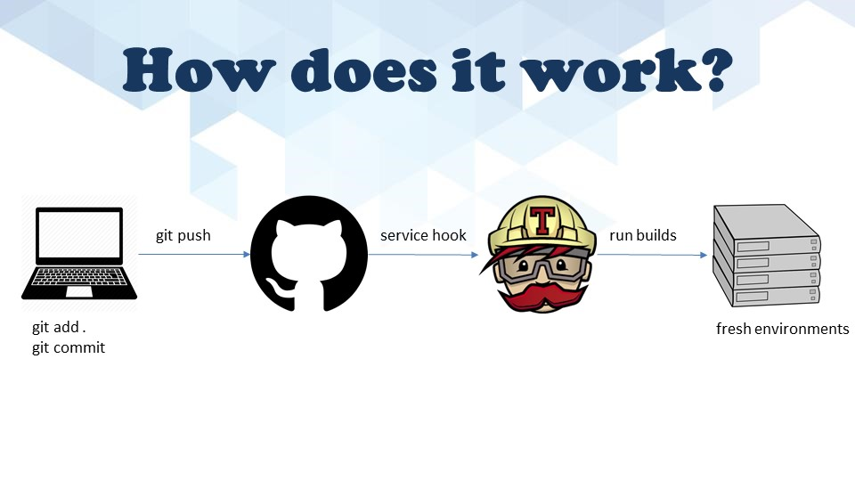

# CSC 519 TechTalk - TravisCI

## Team Members:
* Rishi Jain (rjain9)
* Shriyansh Yadav (scyadav)
* Omkar Acharya (oachary)
* Urmil Parikh (uparikh)

## [Presentation Slides](docs/slides.pptx) | [Demo Screencast](https://youtu.be/EZ3jbORVFHQ) | [Demo Code](https://github.com/rjain9/TravisCI/tree/demo)

## Introduction
### What is Travis CI?
It is a hosted, distributed continuous integration service used to build and test software projects hosted at GitHub.

### What are its functionalities?
* Build artifacts
* Run Tests
* Provide feedback
* Deploy to cloud services

### How does it work?


### What are some pros and cons of Travis CI?
* **Pros:**
  * Variety of collection of plugins
  * Free to use for public project
  * Easy for customization
  * Hosts internal databases (including `MySQL`, `MongoDB`)
  * Easy to use
* **Cons:**
  * No manual builds
  * No build pipelines
  * Need to rely on their on their infrastructure
  * Less extensible not suitable for high security projects

### Other CI tools


### Our view on Travis CI
We like it as it communicates well with `GitHub`. It is very simple to use and does not involve the work of managing packages and plugins as it might be the case in other CI tools like `Jenkins`.

### Setup Instructions
* Create a new GitHub repository or clone it from remote
```
git clone https://github.com/rjain9/TravisCI.git
cd TravisCI
```
* Add `.travis.yml` script at the root of the repository
  * Specify the programming language 
  * Desired building and testing environment
  * Dependencies for those environments
  * Other parameters, if any
```
language: java
sudo: false
script: mvn test
```
* Sign in to [Travis CI](https://travis-ci.org) using GitHub credentials
* Select `Add new repository (+)` from `Dashboard` and enable integration for the repository
* Make some changes in the local repository
```
git add <files>
git commit -m <message>
git push origin <branch>
```
* This will trigger a new build and you can see that on Travis CI's dashboard
